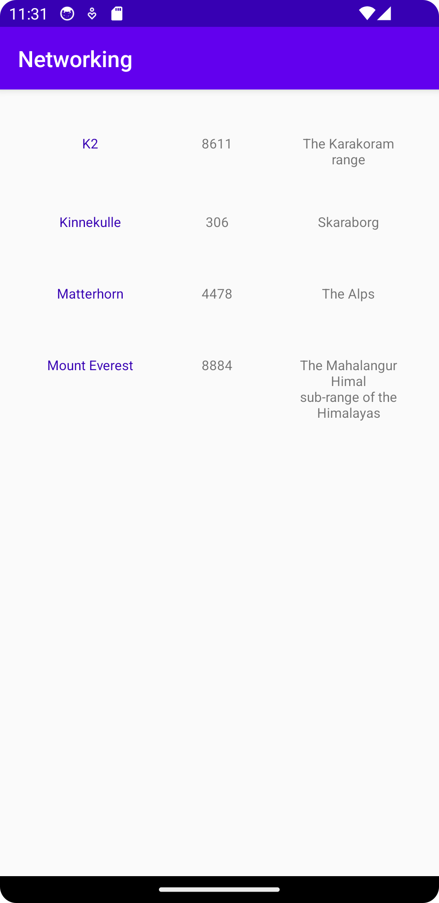

# Rapport

I denna uppgift har jag lärt mig att använda data från json filer och URL:r och hur *RecyclerView* skapas och vad är dess fördelar.
Ytterligare har jag lärt mig mer om XML.
Jag hade en problem med filen och AndroidStudio innan. Nu är det fixat.

- Tillåta internet.
```
 <uses-permission android:name="android.permission.INTERNET" />
```

- Skapar Mountain Klass För att kunna sätta atteributes.
```
public class Mountain {
    private String name;
    private String location;
    private int height;

    public Mountain(){
        name = "No name";
        location = "No Location";
        height = -1;
    }

    public Mountain(String name, String location, int height){
        this.name = name;
        this.location = location;
        this.height = height;
    }

    public String getName() {
        return name;
    }

    public String getLocation() {
        return location;
    }

    public int getHeight() {
        return height;
    }
}
```


- Skapar En adapter för att lägga Mountain attributes från en Json fil till RecyclerView
```
package com.example.networking;

import android.content.Context;
import android.view.LayoutInflater;
import android.view.View;
import android.view.ViewGroup;
import android.widget.TextView;

import androidx.annotation.NonNull;
import androidx.recyclerview.widget.RecyclerView;

import java.util.ArrayList;

public class RecyclerViewAdapter extends RecyclerView.Adapter<RecyclerViewAdapter.ViewHolder>  {
    private ArrayList<Mountain> mountainList;
    private LayoutInflater layoutInflater;
    private onClickListener onClickListener;

    RecyclerViewAdapter(Context context, ArrayList<Mountain> items, onClickListener onClickListener) {
        this.layoutInflater = LayoutInflater.from(context);
        this.mountainList = items;
        this.onClickListener = onClickListener;
    }

    @Override
    @NonNull
    public ViewHolder onCreateViewHolder(@NonNull ViewGroup parent, int viewType) {
        return new ViewHolder(layoutInflater.inflate(R.layout.mountain, parent, false));
    }

    @Override
    public void onBindViewHolder(@NonNull ViewHolder holder, int position) {
        holder.nameTxt.setText(mountainList.get(position).getName());
        holder.locationTxt.setText(mountainList.get(position).getLocation());
        holder.heightTxt.setText(String.valueOf(mountainList.get(position).getHeight()));

    }

    @Override
    public int getItemCount() {
        return mountainList.size();
    }


    public class ViewHolder extends RecyclerView.ViewHolder implements View.OnClickListener{
        TextView nameTxt;
        TextView locationTxt;
        TextView heightTxt;
        public ViewHolder(@NonNull View itemView) {
            super(itemView);

            nameTxt = itemView.findViewById(R.id.nameTxt);
            heightTxt = itemView.findViewById(R.id.heightTxt);
            locationTxt = itemView.findViewById(R.id.locationTxt);
            itemView.setOnClickListener(this);
        }

        @Override
        public void onClick(View view) {
            onClickListener.onClick(mountainList.get(getAbsoluteAdapterPosition()));
        }
    }

    public interface onClickListener{
        void onClick(Mountain mountain);
    }
}
```

## Bilder

